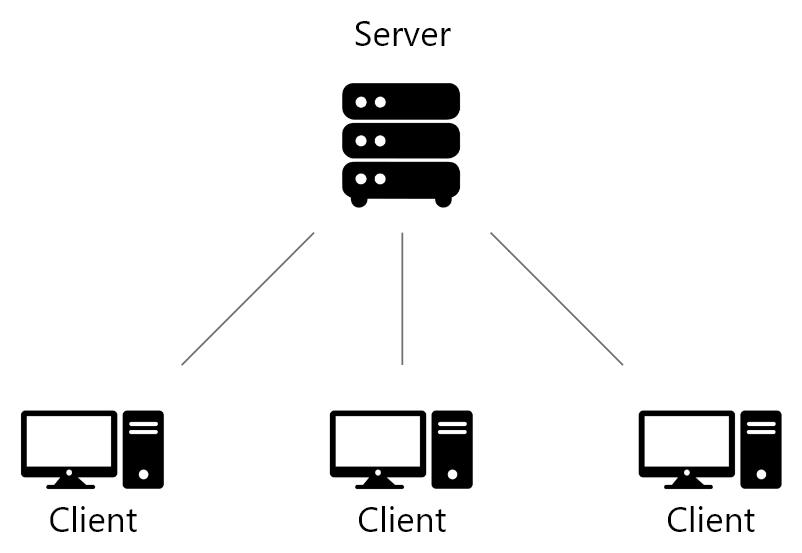
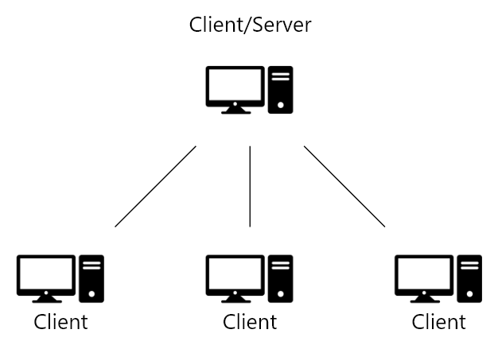
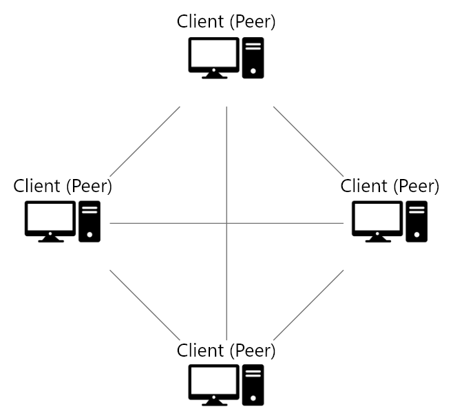
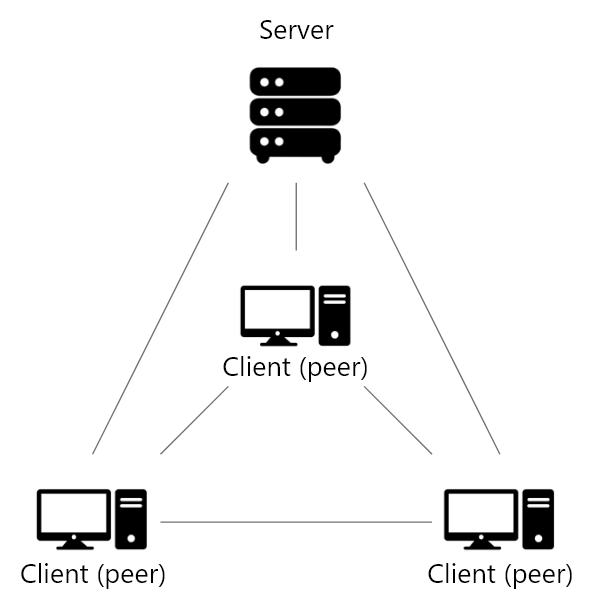

# Network Architectures

## Introduction
For my multiplayer system I started on researching the different types of network architectures that are mostly used in multiplayer games.
The reason for this is that the network architecture is the foundation of every multiplayer system and choosing the right one is important for performance and scalability.
Because every network architecture has its own pros and cons I put them in a table to compare them easily and choose the right one for my multiplayer system.

## Types of Network Architectures
- [Client-Server Architecture](#client-server-architecture)
    - [Dedicated Client-Server Architecture](#1-dedicated-client-server-architecture)
    - [Listen Client-Server Architecture](#2-listen-client-server-architecture)
- [Peer-to-Peer (P2P) Architecture](#peer-to-peer-p2p-architecture)
- [Hybrid Architecture](#hybrid-architecture)

---
## Client-Server Architecture
This is the most used network architecture in multiplayer systems.
In this architecture there is a server that acts as the central authority. It manages game logic, game state, validation of player actions and handles the communication between clients.
Clients or instances of players send their inputs/actions to the server and receive game state updates.

There are 2 types of this architecture:

## 1. Dedicated Client-Server Architecture

In this version there is a dedicated server where the game runs on. this version is the securest and most used version in competitive and large online games.

### Pro's
- **Centralized Control:** The server has full control over the game state, ensuring consistency and preventing cheating.
- **Consistency:** All clients receive updates from the same source, reducing the risk of desynchronization.
- **Scalability:** The server can be optimized to handle many clients, making it suitable for large-scale multiplayer games.

### Con's
- **Cost:** Running a dedicated server can be expensive, especially for large-scale games.
- **Latency:** Players may experience higher latency if the server is geographically distant from them.
- **Single Point of Failure:** If the server goes down, all players are affected.

## 2. Listen Client-Server Architecture

In the version one of the clients also runs the server on there computer.
This version is a little less secure because the client that also runs the game can change the game state, but there is no need for a dedicated server.
Common in smaller games like Minecraft and Terraria.

### pro's
- **Cost-Effective:** Because a client also runs the server there is no need for a dedicated server.
- **Centralized Control:** The server has full control over the game state, ensuring consistency and preventing cheating.
- **Easier to Set Up:** There is no need to set up and maintain a dedicated server, making it easier for small-scale games or local multiplayer.

### con's
- **Host Advantage:** The host may have a performance advantage since they are running both the client and server.
- **Less Security:** Since the host controls the game logic, it may be easier for the host to manipulate the game state.
- **Single point of failure:** If the host leaves or lose there connection, the server goes down and all players are disconnected.
- **Less scalable:** The host may not be able to handle many clients, making it less suitable for large-scale multiplayer games.

---
## Peer-to-Peer (P2P) Architecture

The Peer-to-Peer (P2P) is a network architecture that was used a lot in the early days of multiplayer games.
In this architecture instead of a central server clients(peers) connect directly to each other exchanging game data and game states.
 
Still, some modern games use P2P networking some of these games are Street Fighter, Age of Empires II and Borderlands.

### Pros
- **Cost-Effective:** There is no need for a dedicated server, making it more affordable for small-scale games.
- **Reduced Latency:** Players may experience lower latency since they connect directly to each other.
- **No single point of failure:** If one peer leaves or loses their connection, the game can continue as long as there are other peers connected.
- **Scalability:** The network can grow as more peers join, making it suitable for certain types of multiplayer games.

### Cons
- **Security Risks:** Without a central server, it is easier for players to manipulate the game state and cheat.
- **Consistency:** Harder to maintain a consistent game state across all players.
- **Network Complexity:** Managing connections between multiple peers can be complex and may lead to connectivity issues.
- **Bandwidth Usage:** Each peer must handle multiple connections, which can lead to increased bandwidth usage and potential performance issues.

---
## Hybrid Architecture

The Hybrid network architecture combines elements of the Client-Server and Peer-to-Peer (P2P) architectures to balance performance, scalability, and security.
In this architecture you would have a central server handling critical game logic and game state And less critical game logic like chat massages would go over P2P.

### Pros
- **Improved Performance:** By allowing direct peer-to-peer communication for certain action you can reduce latency and server load.
- **Scalability:** By offloading some tasks to peer-to-peer communication, the server can handle more clients.
- **Security:** By handling critical game logic on the server, it reduces the risk of cheating.

### Cons
- **Complexity:** The hybrid model can be more complex to implement and manage due to the combination of both architectures.
- **Cost:** Even though the server load is reduced, there still needs to be a central server.

---
## Comparison of the Network Architectures
| Architecture            | Pros                                                                     | Cons                                                                  |
|-------------------------|--------------------------------------------------------------------------|-----------------------------------------------------------------------|
| Dedicated Client-Server | Centralized Control, Consistency, Scalability                            | Cost, Latency, Single Point of Failure                                |
| Listen Client-Server    | Cost-Effective, Centralized Control, Easier to Set Up                    | Host Advantage, Less Security, Single point of failure, Less scalable |
| Peer-to-Peer            | Cost-Effective, Reduced Latency, No Single Point of Failure, Scalability | Security Risks, Consistency, Network Complexity, Bandwidth Usage      |
| Hybrid                  | Improved Performance, Scalability, Security                              | Complexity, Cost                                                      |

## Conclusion

After researching and comparing the different network architectures, I have decided to use the Listen Client-Server model for my multiplayer system.
This decision aligns with my project goals because I do not have the budget or access to a dedicated server. For a small-scale multiplayer game, the Listen Client-Server architecture provides a suitable balance of ease of setup, cost-effectiveness, and control over the game state.

## Sources
- https://www.getgud.io/blog/mastering-multiplayer-game-architecture-choosing-the-right-approach/
- https://hogonext.com/how-to-build-multiplayer-games-and-network-architectures/
- https://fish-networking.gitbook.io/docs/guides/high-level-overview/networking-models
